# CREATING A GLIBC CONTAINER IN VOID MUSL

-----


## Authors
Telegram

* @tenshalito Tuxliban Torvalds
* @lumaro Lumaro
-----

## Content
* [Introduction](#Introduction)
* [Creating the sandbox (container)](#Crating-the-sandbox-(container))
* [Endnotes](#Endnotes)
* [Anexxes](#Anexxes)
* [References](#References)
-----

## Introduction
When the Musl version of Void is installed, some users may have noticed that there are some programs that cannot be used natively due to the incompatibility of the standard Glibc and Musl C libraries. (Anonymous, 2015).

Musl is a lighter, faster, simpler, free implementation of the C standard, striving for compliance and security.

Void officially supports Musl for all platforms except i686. All packages provided through the official repositories are available with Musl binaries, in addition to their Glibc equivalents.

As Glibc is almost a standard in most GNU / Linux distributions, it is almost 100% sure that the software is compiled with it. Fortunately, Void offers the user to choose which C standard they want to install: Musl and Glibc, as well as the installation mode: Void-live or chroot, through tarball or through the download of the different system bases available from the repository: base -chroot, base-minimal, base-system, or base-voidstrap.

-----


## Creating the sandbox (container)
As mentioned above, if the Musl version is used in Void (or another distro that supports this library) they will not be able to run binaries that do not have an open source license or similar. It will even be impossible to try running i686 (32-bit) architecture programs.

Therefore, when creating a container, the options or advantages that we will have is that you can run all the packages available for the Void + Glibc version, or install development tools to do and undo whatever you want without fear of breaking the main system.

As mentioned on the Void site, with the base-voidstrap metapackage an isolated environment will be created in a directory of our system (Void, 2017). Therefore, we proceed with the following steps:

1.- Create the directory to be used as the container:
```
sudo mkdir -p /glibc
```
2.- Download and install the base-voidstrap metapackage in the directory created in the previous step:
```
sudo env XBPS_ARCH=x86_64 xbps-install --repository=http://alpha.de.repo.voidlinux.org/current -r /glibc -S base-voidstrap
```
You may wonder what does the command line above mean?

3.- Well, it means the following:
* **sudo:** Required to be able to scale write permissions to the root directory.
* **env:** Because sudo is being used, this command is required to execute run xbps-install with the environment variables modified without being affected by those that are set by default by the system.
* **XBPS_ARCH=x86_64:** When using the version of Void with Musl, you must download the version of Glibc also for 64-bit architectures. So with this version it will also be possible to run 32-bit programs.
* **--repository=http://alpha.de.repo.void.linux.org/current:** The mirror that will be used to download the necessary packages. It can be modified and configured by someone who is closer to the user.
* **-r /glibc:** It is the "root" directory where the executables will be stored.
* **base-voidstrap:** It's the metapackage used to create containers. Contains basic programs for minimalist operation.

4.- When executing the command line of step two, the system will ask the user if they want to import the fingerprint of the package that they want to install.

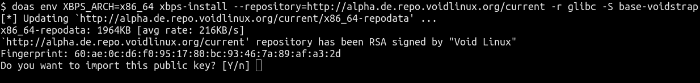
 *You have to accept to continue with the installation*
 
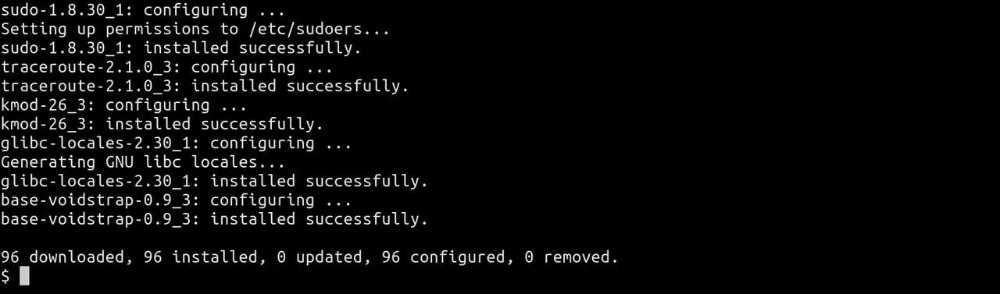
 ***Author's note:** I replaced sudo with doas*

5.- Once you have configured and installed the necessary packages, you have to create a C program that will help us execute the container binaries.

6.- For obvious reasons, and to identify what we will execute, the name we will give to this program will be glibc.c
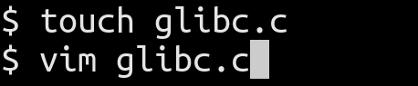

*We create a file with that name and then we will proceed to edit*

7.- The program called glibc.c will create a new mount namespace. In turn, the rest of the root directory will be reused(Alejandroliu, 2019).
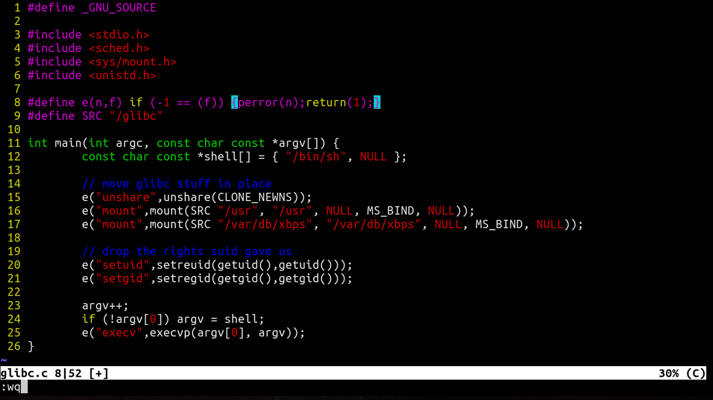

```
#define _GNU_SOURCE
#include <stdio.h>
#include <sched.h>
#include <sys/mount.h>
#include <unistd.h>


#define e(n,f) if (-1 == (f)) {perror(n);return(1);}
#define SRC "/glibc"


int main(int argc, const char const *argv[]) {
        const char const *shell[] = { "/bin/sh", NULL };


        // move glibc stuff in place
        e("unshare",unshare(CLONE_NEWNS));
        e("mount",mount(SRC "/usr", "/usr", NULL, MS_BIND, NULL));
        e("mount",mount(SRC "/var/db/xbps", "/var/db/xbps", NULL, MS_BIND, NULL));


        // drop the rights suid gave us
        e("setuid",setreuid(getuid(),getuid()));
        e("setgid",setregid(getgid(),getgid()));


        argv++;
        if (!argv[0]) argv = shell;
        e("execv",execvp(argv[0], argv));
}
```

8.- Now the next step is to compile and install the program.
    
a) We compile the code as follows:
   
```
gcc -s -o glibc glibc.c
```
   
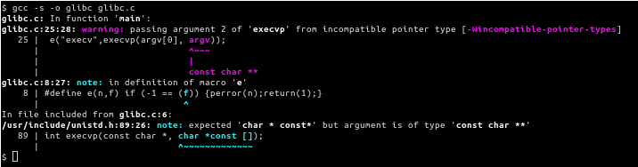
 
*Note: It will show us these warnings that, for our purposes, are not serious.*
    
b) Put the binary in a directory that appears within our path. In this case it will be in the root directory of the system executables:
    
```
doas cp glibc /usr/bin
```
    
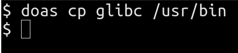
    
c) Now for the binary to work correctly you have to change its ownership to administrator (root)
    
```
doas chown root:root /usr/bin/glibc
```
    
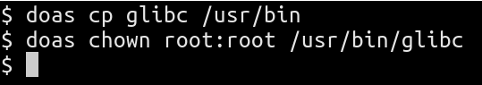
   
d) The user or group ID is set on execution and is assigned execution permissions:
    
```
doas chmod +sx /usr/bin/glibc
```
    
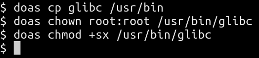
    
*Including the + sign adds the specified properties*

9.- Now we install a package that cannot be natively run in Musl such as MEGAsync, openshot or dropbox (precompiled binary from the official dropbox site)
    
a) First we enter the container calling the binary that we previously created.
    
**Note:** In case you have configured bash or another shell as default, when you write the name of the glibc binary in the console, it will automatically change to dash
    
```
glibc
```
    
b) We proceed to change from user to administrator (root) in order to update the system (if updates are available), or install packages
    
```
su
xbps-install -Su
```
    
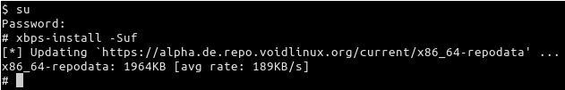
    
c) For this example we will install MEGAsync which, according to your template, cannot be built for use with Musl (Johnnynator, 2019)
    
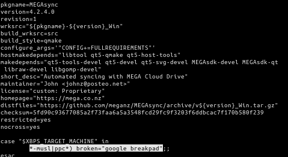
    
*In the template it is clearly appreciated that both for musl and ppc, this package cannot be built*
    
```
xbps-install --repository=/path/ foo
```

**Author's note:** replace /path with the absolute path of the package you want to install in case you have created a binary using xbps-src and replace foo with the package name

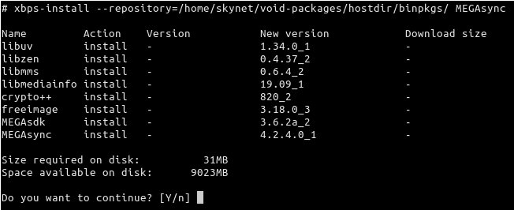

*We proceed to install the package that was previously built using xbps-src*

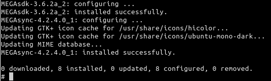
    
d) Now to run the binary it can be done in two ways:

I. Run it from the container:

i. We leave the administrator account with exit or with the key combination *ctrl d*

ii. We run it from the console emulator
            
```
megasync
```
            
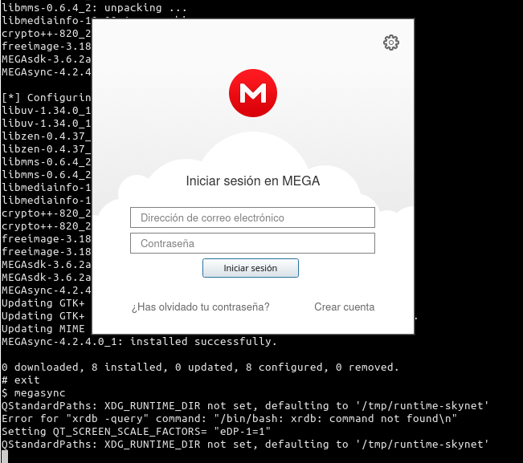
            
*If you want to leave the program in the background, just add an & at the end of the command line*
        
II. Run it from the host system (Musl)
            
i. Directly from the host system console emulator write:
            
```
glibc megasync
```
            
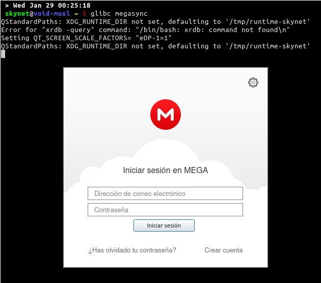
            
*As in the previous case, if you want to leave the process in the background add a **&***

**Another example of running Vivalvi in Void Musl**
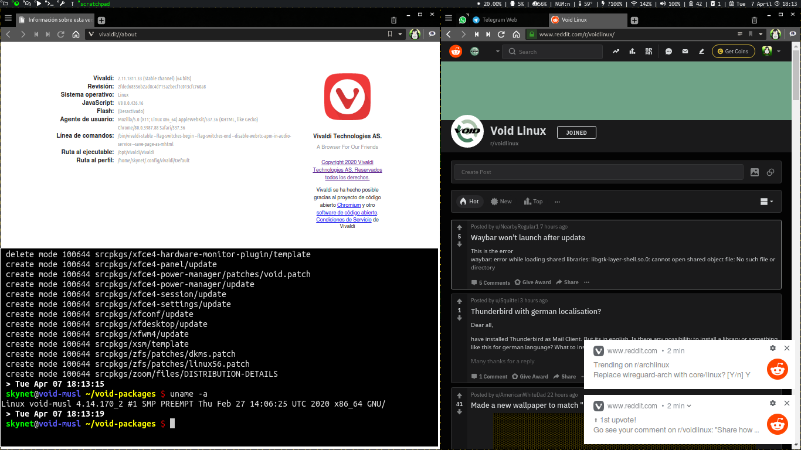

-----


## Endnotes
* The installation and execution process of compiled binaries for the Glibc library will be the same.
* If desired, you can add shortcuts or keyboard shortcuts, but the process will depend on the configuration and desktop that the user has.

-----


## Anexxes

If you want to install the following packages, install their respective dependencies as well

1. Telegram

```
# xbps-install libdrm libICE libSM
```

2. Brave

```
# xbps-install nss at-spi2-atk libgbm alsa-lib gtk+3
```

3. Palemoon

```
# xbps-install libvpx alsa-lib dbus-glib libXt gtk+
```

4. Zoom meeting

```
# xbps-install fontconfig glib libpulseaudio libSM libX11 libxcb libXcomposite libXfixes libXi libXcursor xcb-util-keysyms xcb-util-image nss libxshmfence libXrender libXrandr qt5-quickcontrols qt5-script mesa mesa-dri libxslt
```


5. Dropbox

```
# xbps-install libglapi libxshmfence libXxf86vm qt5dxcb-plugin
```

-----


## References
* Alejandroliu. (2019). Void Glibc in Musl. Github [Website]: https://github.com/alejandroliu/0ink.net/blob/master/snippets/void-glibc-in-musl/glibc.c
* Anonymous. (August 16th, 2015). Difference between Musl and non-Musl ISOs? Reddit [Website]. https://www.reddit.com/r/voidlinux/comments/3h8aug/difference_between_musl_and_nonmusl_isos/
* Jonnynator. (2019). Megasync/template. Github [Website]:  https://github.com/void-linux/void-packages/blob/master/srcpkgs/MEGAsync/template
* Voidlinux (2017). The Advent of Void: Day 4: containers. Voidlinux [Website]: https://voidlinux.org/news/2017/12/advent-containers.html

-----


GUIDE TO CREATING A GLIBC CONTAINER IN VOID MUSL by [Tuxliban Torvalds in collaboration with Lumaro ](https://www.dropbox.com/s/4nbh5f1xva84h1m/Contenedor_Void.pdf?dl=0)is distributed under a [Creative Commons Attribution Share-Alike 4.0 International License.](http://creativecommons.org/licenses/by-sa/4.0/)
Based on a work in https://github.com/alejandroliu/0ink.net/blob/master/snippets/void-glibc-in-musl/glibc.c
